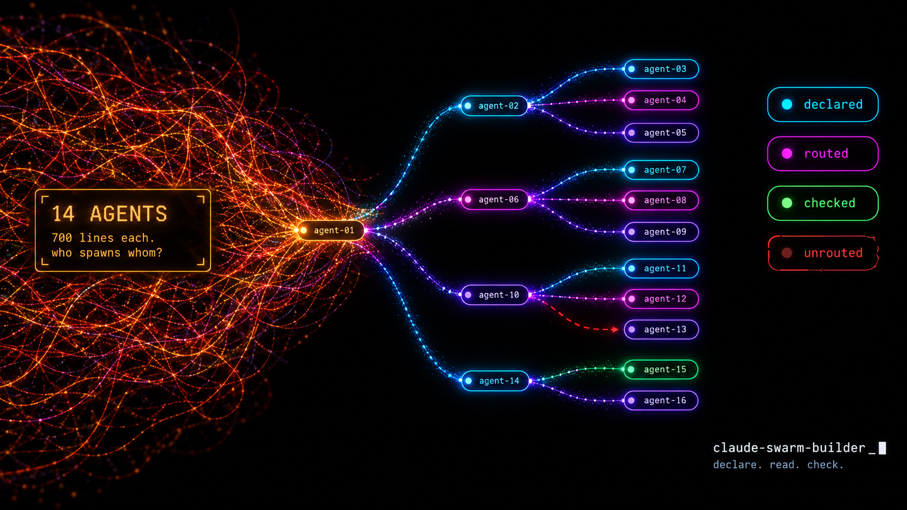

# claude-swarm-builder



Declare a swarm of Claude Code agents once, in `swarm.json` — who spawns whom, with what, what comes back, who may do what irreversible, what it costs. Read it as a map. Check it on every pull request.

Structure goes in the JSON. Behaviour stays in the agent MDs, where it already is.

## Why

A loop of agents grows one issue at a time. Each fix is right in its file; nobody holds the graph. The result runs and still carries dead rules, duplicate paths and states nobody catches — the failure where every file is correct and the loop is wrong. Declaring the tree for [claude-oss](https://github.com/Digital-Process-Tools/claude-oss) found six of those in one evening, before any checker existed. `docs/why.md`.

## Three verbs

| | |
|---|---|
| `/swarm-builder:declare` | write `swarm.json` from the repo's agent MDs — structure only, never guessed |
| `/swarm-builder:read` | build the page: map per flow, node cards with in/out, edge contracts, step player |
| `/swarm-builder:doctor` | run the rules; three states per rule, `could-not-check` never reads as `ok` |
| `/swarm-builder:compile` | inject each agent's role summary, scripts list and incoming contract into its MD, idempotently |

Linting prose against the JSON (a spawn named in an agent's MD with no matching edge) is not
built yet — that is doctor rule R09. `ISSUES.md` lists what is left, each one a bounded issue.

## Install

```
/plugin install swarm-builder@dpt-plugins
```

Or clone and run the scripts directly — plain Python 3.9+, `jsonschema` is the one dependency.

## The model, in one screen

```
agent:  md · summary · model · tools · authority · lifetime · inherits · budget_bytes · cost_tokens · context[] · scripts[]
edge:   id · from · to · count · when · terminal · isolation · brief{} · handback[]
flow:   root · trigger[] · edges[]
```

No roles in the schema — `lane`, `auditor`, `manager` are presets copied from an example, never read by the model. No actions on edges: `when` routes, it never says "do this"; what gets done is a script when it is a rule and prose when it is judgment. `docs/model.md`.

## Worked example

`examples/claude-oss.swarm.json` — 15 agents, 21 edges, and the six things declaring it exposed under `declared_but_unrouted`. `python3 scripts/swarm_reader.py examples/claude-oss.swarm.json` renders it.

## Prior art

Three canvases (claude-studio, ccbuilder, AgenTopology) and one description format (Swarm Skills) exist. None declares edges as data for MD-defined agents, checks authority on an edge, joins measured cost to a design, or round-trips hand-written prose. AgenTopology was tried on claude-oss: its import dropped every MD body and fabricated an alphabetical flow that then "passed all validation rules". `docs/prior-art.md`.

## License

Community License — free to use, copy and modify for personal, educational and internal business purposes; no commercial redistribution. See `LICENSE`.
