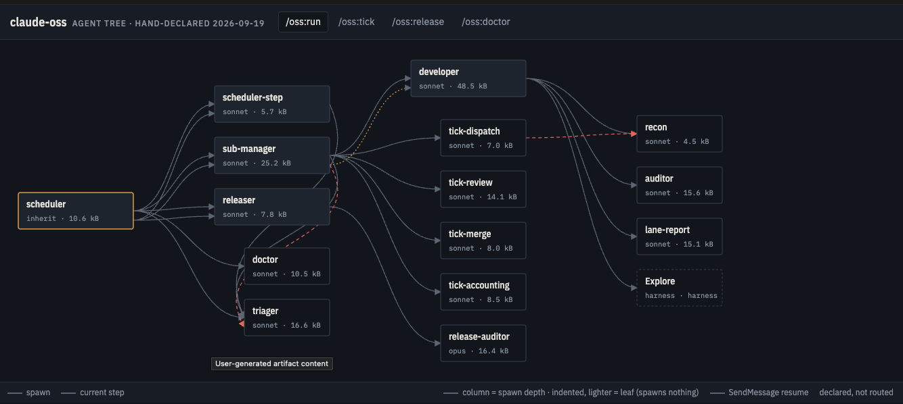

# claude-swarm-builder


Declare a swarm of Claude Code agents once, in `swarm.json` — who spawns whom, with what, what comes back, who may do what irreversible, what it costs. Read it as a map. Check it on every pull request.

Structure goes in the JSON. Behaviour stays in the agent MDs, where it already is.

## Why

A loop of agents grows one issue at a time. Each fix is right in its file; nobody holds the graph. The result runs and still carries dead rules, duplicate paths and states nobody catches — the failure where every file is correct and the loop is wrong. Declaring the tree for [claude-oss](https://github.com/Digital-Process-Tools/claude-oss) found six of those in one evening, before any checker existed. `docs/why.md`.

## Three verbs

| | |
|---|---|
| `/swarm-builder:declare` | write `swarm.json` from the repo's agent MDs — structure only, never guessed |
| `/swarm-builder:read` | build the page: map per flow, node cards with in/out, edge contracts, step player |
| `/swarm-builder:doctor` | run the rules; three states per rule, `could-not-check` never reads as `ok` |
| `/swarm-builder:compile` | inject each agent's role summary, scripts list and incoming contract into its MD, idempotently |

Linting prose against the JSON (a spawn named in an agent's MD with no matching edge) is doctor
rule R09. What is left is on the [issue tracker](https://github.com/Digital-Process-Tools/claude-swarm-builder/issues), each one a bounded issue.

## Install

```
/plugin install swarm-builder@dpt-plugins
```

Or clone and run the scripts directly — plain Python 3.9+, `jsonschema` is the one dependency.

## Building a swarm, step by step

The structure of a swarm lives in `swarm.json`; the behaviour of each agent lives in its MD. The
tool's job is to get the structure right before any behaviour is written, and to keep the two
from drifting apart afterwards. Two ways in, one loop after that. Steps marked *planned* are
filed, not shipped — the issue number says where.

**1. Install the plugin.**

```
/plugin install swarm-builder@dpt-plugins
```

**2. Get to a `swarm.json`.** Either:

- **You have agents already** — `/swarm-builder:declare`. It reads the MDs and every file they
  load, and writes structure only: one catalogue entry per agent (`md`, `summary`, `model`,
  `tools`, `authority`, `lifetime`, `budget_bytes`, `context`, `scripts`) and one edge per
  literal spawn it can locate (`from`, `to`, `when`, `brief`, `handback`). A spawn it can only
  find in prose goes under `declared_but_unrouted` with a file:line — never guessed into an
  edge. Expect this step to surprise you; writing the tree is where stale rules show.

- **You have nothing yet** — `/swarm-builder:design` *(planned, #30)*. An interview, in your
  domain, not a template: what runs, what triggers it, which actions are irreversible and who
  may take them, where a human must stay in the loop, what a run may cost. It restates what it
  understood, you correct it, then it proposes the fewest agents that satisfy the need — as
  `swarm.json`, structure only, named from your words. It never starts from an example;
  `examples/` are examples.

**3. Look at it — `/swarm-builder:read`.** The page: one map per flow, a card per node with its
in/out edges, the contract on every edge, a step player. A broken relation is a thing you see in
a second here and would read for a minute in JSON. `design` ends every round on this page and
asks whether it looks like what you need; loop until it does.



This is `examples/claude-oss.swarm.json` as the reader draws it: 15 agents in four columns of
spawn depth, model and budget on every card, the `Explore` node dotted because it is the harness's
and has no MD, and the dashed red edges the ones declared in prose that no spawn routes. *Planned
(#28)*: every doctor finding drawn on the map the same way — an unrouted handback state, an agent
nothing reaches, a child holding more authority than its parent — so the picture is the check,
not only the text.

**4. Refine by hand.** `swarm.json` is the file you edit from here on; `docs/model.md` is the
schema in prose. Three things only you decide:

- *Relations* — which handback state of one edge routes to which other edge (`when:
  <to>.handback == <state>`), and which states deliberately route nowhere (`terminal: true`).
- *Contracts* — what the parent passes (`brief`: pointers such as an issue number or a worktree
  path, never a summary of parent state) and the closed set of states the child hands back
  (`handback`).
- *Authority* — the irreversible things each agent may do (`commit`, `merge`, `tag`, `publish`),
  narrowing as you go down the tree.

**5. Check it — `/swarm-builder:doctor`.** Rules R01–R09, three states per rule: `ok`, a
finding, or `could-not-check`. The third is not the first. Exit 1 means an error-level finding:
fix the JSON when the declaration was wrong, the MD when the loop was wrong — the doctor cannot
tell those apart, you can.

**6. Compile — `/swarm-builder:compile`.** Injects each agent's fixed part — role summary, scripts
list, the incoming contract aggregated over every edge pointing at it — into its MD between
`<!-- swarm:begin -->` / `<!-- swarm:end -->`. Idempotent; the prose outside the markers is yours
and untouched. *Planned (#29)*: when the `md` does not exist yet, compile creates the skeleton —
frontmatter from the JSON, the block, one empty heading per handback state — and nothing else.

**7. Write the behaviour.** Yours to write, one agent at a time, under the skeleton's headings:
what it does with the brief, when it hands back each state, what it refuses.
`/swarm-builder:write <agent>` *(planned, #31)* co-writes it with you from that agent's compiled
contract — asks per handback state, per authority, writes only what you confirmed, never a batch
of agents in one pass. Fabricated agent bodies are the failure `docs/prior-art.md` records; this
is built not to be that.

**8. Gate it in CI.** Two lines, so the declaration and the MDs cannot drift apart unnoticed:

```
python3 scripts/swarm_doctor.py swarm.json --root .
python3 scripts/swarm_compile.py swarm.json --root . --check
```

This repo runs the first against `examples/clean.swarm.json` on every pull request
(`.github/workflows/tests.yml`); its own `swarm.json` is declared the same way.

Then loop: an agent changes, `declare` extends the JSON, `read` shows what moved, `doctor` says
what broke, `compile` re-syncs the MDs.

## Swarms worth declaring

Ideas, not templates — each written along the axes the `design` interview asks about, so they
double as examples of how to think about your own. The claude-oss loop in `examples/` is one more
of these, fully worked; it is not the shape yours should take.

- **Security review on every pull request.** Trigger: PR opened. One reader per changed
  component, a verifier per candidate finding that argues *against* it, one reporter. Authority:
  comment on the PR, nothing else; a human merges. The interesting contract is verifier →
  reporter: `confirmed | refuted | could-not-tell`, and `could-not-tell` is reported, never
  dropped.
- **Dependency updates.** Trigger: a bot's PR. Changelog reader, test runner, one merger with
  authority `merge` for patch and minor bumps only; a major bump routes to a human node. The
  edge that matters is the one that says which bumps the merger may not take.
- **Documentation drift.** Trigger: merge to main. Diff public surface against docs, file one
  issue per gap, a writer lane per issue that opens a PR. Authority stops at `open PR`.
- **Incident first response.** Trigger: an alert on a channel. Log reader, then three hypothesis
  lanes in parallel — each hands back `supported | refuted | need-data` — and a scribe that
  drafts the timeline. No irreversible authority anywhere; the human on call decides.
- **Support inbox.** Trigger: new ticket. Classifier, an answerer with read access to the
  product, a human node holding `send`. The classifier's handback is the routing table for the
  whole swarm, so it is the contract to get right first.
- **Nightly data quality.** Trigger: cron. One checker per table, each with a `budget_bytes`
  small enough to run cheaply, a filer that opens issues. What it exposes when declared: which
  checkers nobody routes when they fail.

Each of these is a `swarm.json` of five to ten agents. The point of declaring one before writing
it is the same every time: the contract between two agents is decided on the picture, not
discovered in production.

## The model, in one screen

```
agent:  md · summary · model · tools · authority · lifetime · inherits · budget_bytes · cost_tokens · context[] · scripts[]
edge:   id · from · to · count · when · terminal · isolation · brief{} · handback[]
flow:   root · trigger[] · edges[]
```

No roles in the schema — `lane`, `auditor`, `manager` are presets copied from an example, never read by the model. No actions on edges: `when` routes, it never says "do this"; what gets done is a script when it is a rule and prose when it is judgment. `docs/model.md`.

## Worked example

`examples/claude-oss.swarm.json` — 15 agents, 21 edges, and the six things declaring it exposed under `declared_but_unrouted`. `python3 scripts/swarm_reader.py examples/claude-oss.swarm.json` renders it. The built page always tries `fetch('swarm.json')` first, so it only picks up a sibling when one is served under exactly that literal name — this worked example is built from `claude-oss.swarm.json`, so opening its rendered page exercises the embedded-payload fallback, not the live fetch, unless you also save the JSON alongside it as `swarm.json`. Either way the JSON stays the thing you edit.

## Prior art

Three canvases (claude-studio, ccbuilder, AgenTopology) and one description format (Swarm Skills) exist. None declares edges as data for MD-defined agents, checks authority on an edge, joins measured cost to a design, or round-trips hand-written prose. AgenTopology was tried on claude-oss: its import dropped every MD body and fabricated an alphabetical flow that then "passed all validation rules". `docs/prior-art.md`.

## License

Community License — free to use, copy and modify for personal, educational and internal business purposes; no commercial redistribution. See `LICENSE`.
